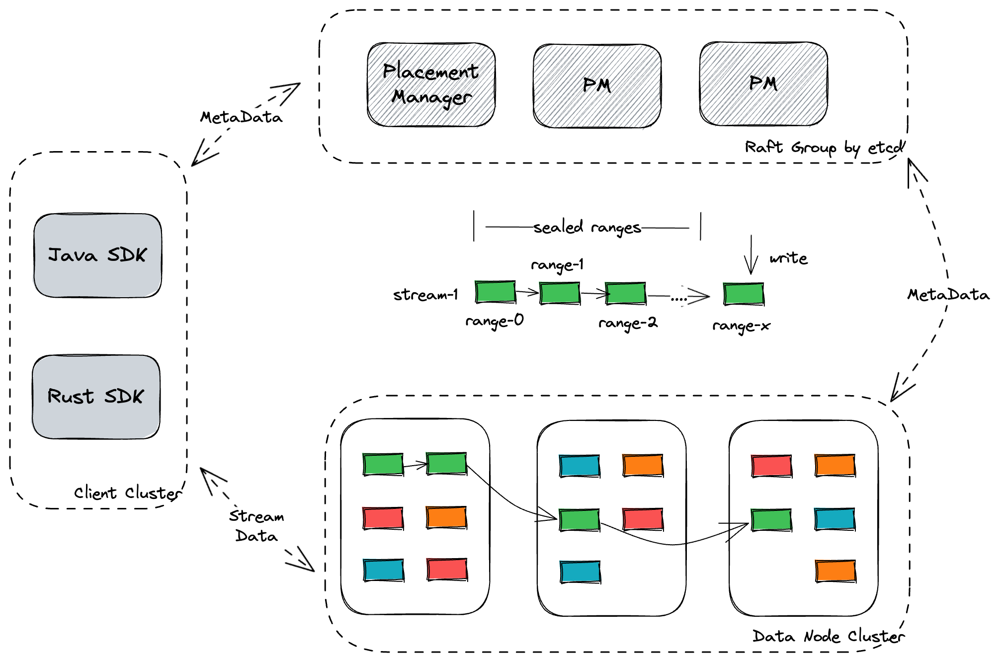
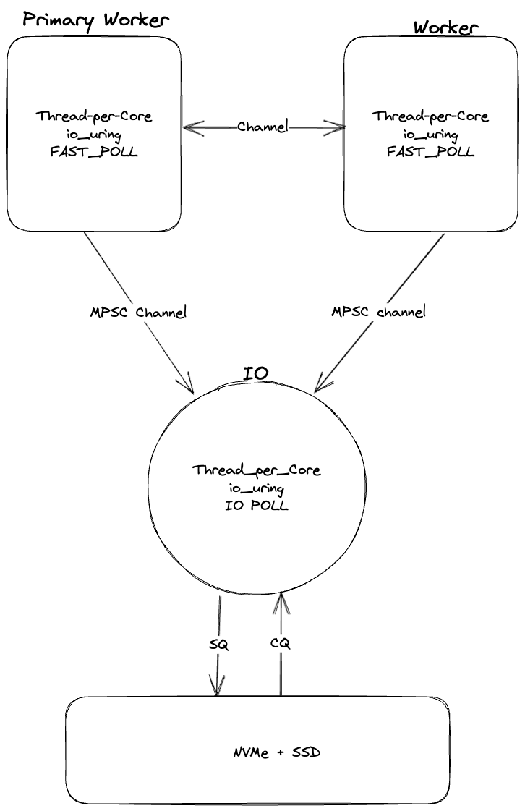

## Introduction
ElasticStream is an open-source, elastic streaming platform. ElasticStream is designed to stand on shoulders of cloud infra-structure,
excelling itself in scalability, fault-tolerance, cost-effectiveness and security.


## Architecture Overview
ElasticStream has three components: placement-manager, data-node and clients.


## Data Node Threading Model
Primary design goal of data-node is to scale linearly with addition of hardware: including CPU and SSD. To achieve this, threads of it must be as independent from one another as possible, to avoid software locks and even atomic instructions. With that said, instead of centralizing shared data in a global location that all threads access after acquiring a lock, each thread of data-node has its own data. When other threads want to access the data, they pass a message to the owning thread to perform the operation on their behalf through lockless ring-buffers. 

Data-node has 3 categories of threads: worker threads, IO thread and miscellaneous auxiliary threads. The former two kinds follows [Thread-per-Core](https://www.datadoghq.com/blog/engineering/introducing-glommio/) architecture while auxiliary threads use traditional multi-threads parallelism, with CPU affinity set.



Each data-node, by default, has one IO thread, taking up a dedicated core, running an io_uring instance with SQ_POLLING and IO_POLLING. This configuration offers best [latency performance](docs/benchmark.md) and makes most the [modern storage capabilities](https://atlarge-research.com/pdfs/2022-systor-apis.pdf).

Multiple independent workers runs in parallel within a data-node. Each of them are backed by an io_uring instance with FAST_POLL feature set. A worker also takes up a dedicated core and is in charge of a group of streams. Inter-worker communication is fulfilled by way of message passing, aka, lockless ring buffer. 

## How to Build
Rust crates are managed by cargo. To build data node,

### Debug Mode
```
cargo build
```

### Release Mode
```
cargo build --release
```

## Collect and Report Unit Test Coverage

```sh
cargo llvm-cov
```

With HTML report,
```sh
cargo llvm-cov --html
```
or 
```sh
cargo llvm-cov --open
```

If wishing to execute `cargo run` instead of `cargo test`, use run sub-command:

```sh
cargo llvm-cov run
```

Read [more](https://crates.io/crates/cargo-llvm-cov)

Sample [integration](https://github.com/taiki-e/cargo-llvm-cov) with github action.

## How to Contribute
We welcome contribution of various types: documentation, bug reporting, feature request, and pull requests. Before proposing a major large-scale change, it is advised to discuss your proposal first.

## Notes

### **communicating-between-sync-and-async-code**
`Store` module is built on top of io-uring directly. The `Server` module, however, is built using `tokio-uring`, following thread-per-core paradigm, which as a result is fully async. Reading and writing records between these two modules involve communication between async and sync code, as shall comply with [the following guideline](https://docs.rs/tokio/latest/tokio/sync/mpsc/index.html#communicating-between-sync-and-async-code) 

## Run with Address Sanitizer 

Sometimes you have to deal with low-level operations, for example, interacting with DMA requires page alignment memory. Unsafe code is required to handle these cases and address sanitizer would be helpful to maintain memory safety.

```sh
RUSTFLAGS=-Zsanitizer=address cargo test test_layout -Zbuild-std --target x86_64-unknown-linux-gnu
```
Read the [following link](https://doc.rust-lang.org/beta/unstable-book/compiler-flags/sanitizer.html) for more advanced usage.


## Run

### Launch Data-Node Server
```sh
cargo run --bin data-node -- -c etc/config.yaml
```