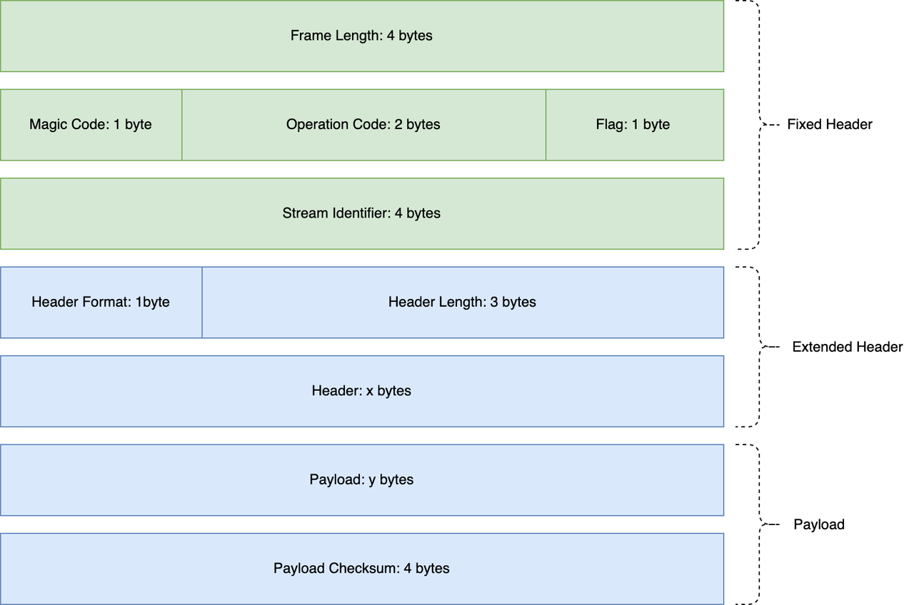

# Streaming Batch Protocol(SBP) v0.1

## Overview

The Streaming Batch Protocol (SBP) is a frame base protocol. All frames begin with a fixed 12-octet header, followed by an extended header and payload. Below graph shows the layout of a frame.

The protocol is big-endian (network byte order).

Each frame contains a fixed-size header followed by a variable-size extended header and payload. The header is described in Section 2. The content of the extended header and payload depends on the header operation code. The list of supported operation codes and the details of the payload are described in Section 4. The frame's payload is opaque to the SBP frame format and is interpreted by the application layer.

The design of SBP follows two principles:
- Batch: SBP is designed to support batch processing, which means that the client can send multiple requests in one frame, and vice versa. This is useful for reducing the overhead of network communication.
- Streaming: The server does not need to respond to all the requests in a single batch, which means that the server could respond to the requests in a streaming way to reduce the latency of the response.

## Frame Header
The Frame Header is a fixed 12-octet header that appears at the beginning of every frame. It contains fields for the Frame Length, Magic Code, Operation Code, Flags, and Stream Identifier.

### Frame Length
The length of the frame is expressed as a 32-bit integer.
### Magic Code
A fixed value representing the protocol self. Currently, the value is 23. This field is used to detect the presence of the SBP protocol, and implementations MUST discard any frame that does not contain the correct magic number.
### Operation Code
The 16-bit opcode of the frame. The frame opcode determines the format and semantics of the frame. Implementations MUST ignore and discard any frame with an unknown opcode.
### Flags
Flags apply to this frame. The flags have the following meaning (described by the mask that allows selecting them):
- 0x01: Response flag. If set, the frame contains the response payload to a specific request frame identified by a stream identifier. If not set, the frame represents a request frame.
- 0x02: Response end flag. If set, the frame is the last frame in a response sequence. If not set, the response sequence continues with more frames. The response sequence may contain zero or more frames.

The rest of the flags are currently unused and ignored.
### Stream Identifier
A unique identifier for a request frame or a stream request frame. That is, it is used to support request-response or streaming communication models simultaneously. The stream identifier is expressed as a 32-bit integer in network byte order.

When communicating with the server, the client must set this stream id to a non-negative value. It is ensured that the request and response frames will have matching stream ids.
### Extended Header
The extended header starts with format and length fields. The format field is used to identify the serialization format of the extended header. The length field is used to determine the length of the extended header. The length field is expressed as a 24-bit integer in network byte order. The extended header is followed by the payload.

Currently, SBP only defines one format type:
- 0x01: FlatBuffers format indicates that the payload of the extended header is serialized by flatbuffers.

## Frame Definitions
This specification outlines various types of frames, each with a unique 16-bit opcode to identify them. Each frame type has its own specific extended header and payload.

The table below shows all the supported frame types along with a preallocated opcode.

| Opcode | Frame Type | Description |
|--------|------------|-------------|
| 0x0001 | PING | Measure a minimal round-trip time from the sender. |
| 0x0002 | GOAWAY | Initiate a shutdown of a connection or signal serious error conditions. |
| 0x0003 | HEARTBEAT | To keep clients alive through periodic heartbeat frames. |
| 0x1001 | APPEND | Append records to the data node. |
| 0x1002 | FETCH | Fetch records from the data node. |
| 0x2001 | LIST_RANGES | List ranges from the PM of a batch of streams. |
| 0x2002 | SEAL_RANGES | Request seal ranges of a batch of streams. The PM will provide the `SEAL_AND_NEW` semantic while Data Node only provide the `SEAL` semantic. |
| 0x2003 | SYNC_RANGES | Syncs newly writable ranges to a data node to accelerate the availability of a newly created writable range. |
| 0x2004 | DESCRIBE_RANGES | Describe the details of a batch of ranges, mainly used to get the max offset of the current writable range. |
| 0x3001 | CREATE_STREAMS | Create a batch of streams. |
| 0x3002 | DELETE_STREAMS | Delete a batch of streams. |
| 0x3003 | UPDATE_STREAMS | Update a batch of streams. |
| 0x3004 | GET_STREAMS | Fetch the metadata of a batch of streams. |
| 0x3005 | TRIM_STREAMS | Trim the min offset of a batch of streams. |
| 0x4001 | REPORT_METRICS | Data node reports metrics to the PM. |